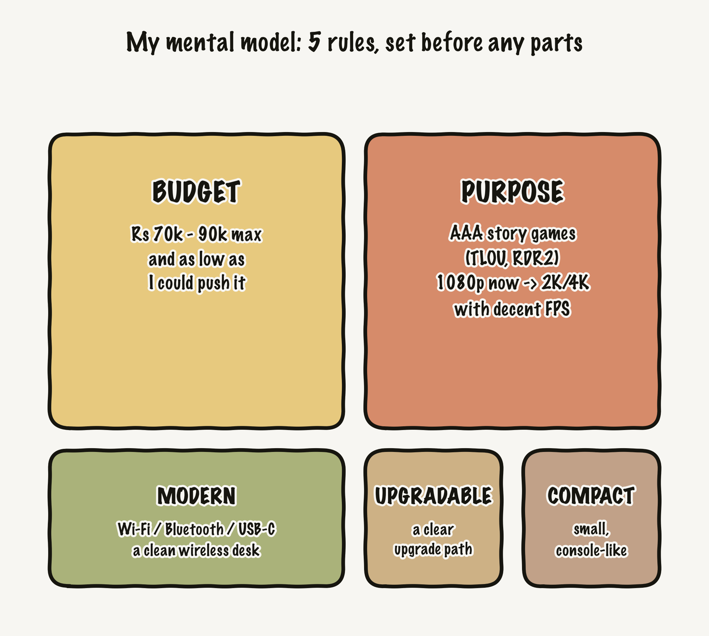
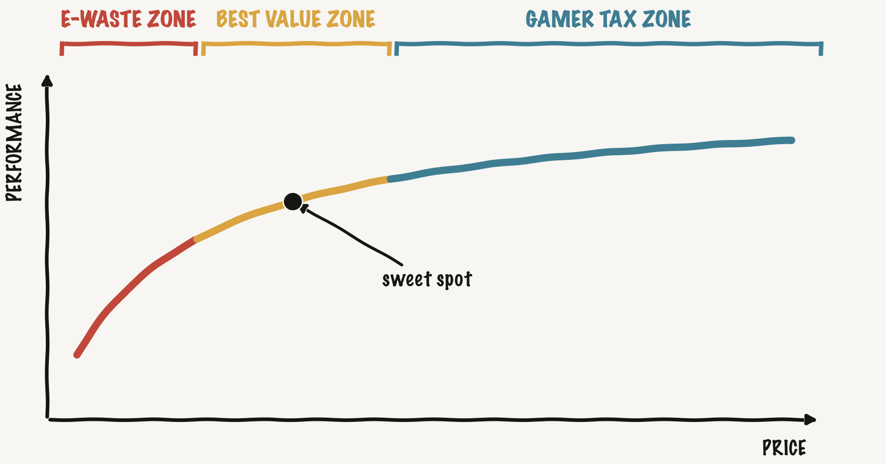
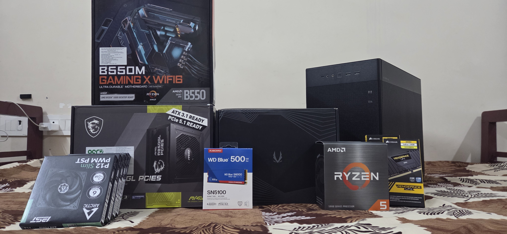
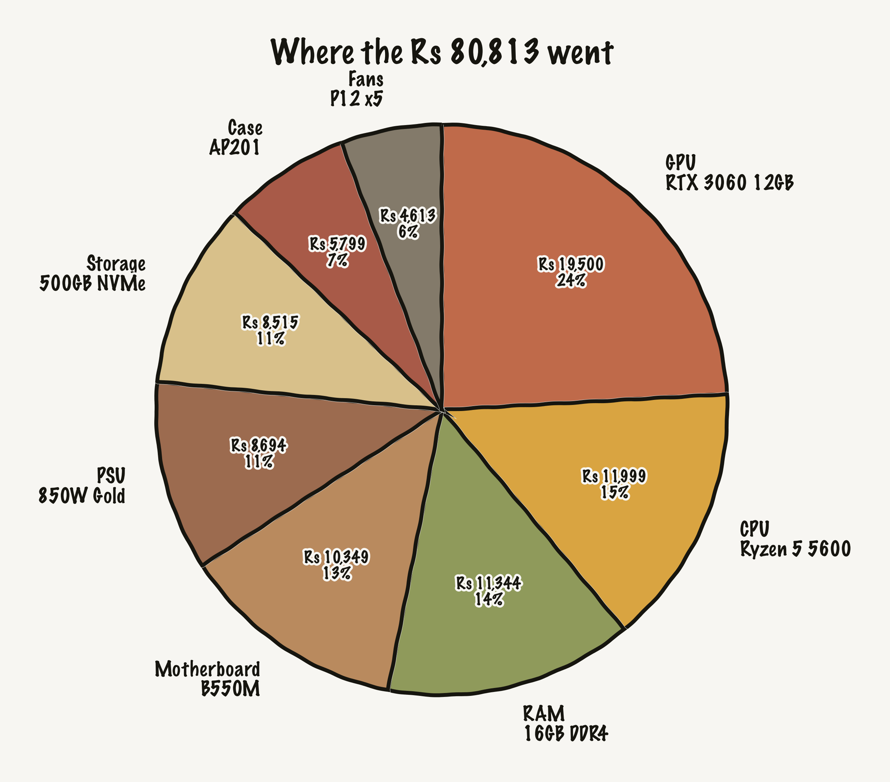
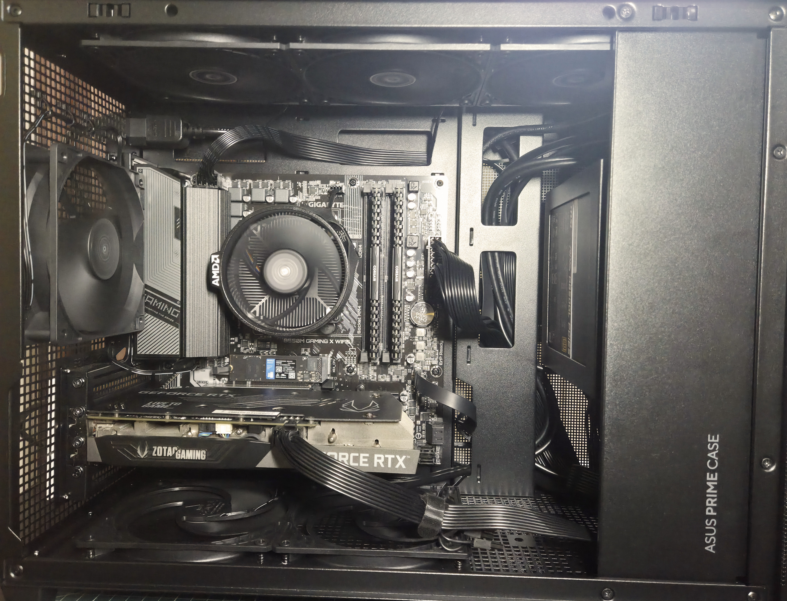
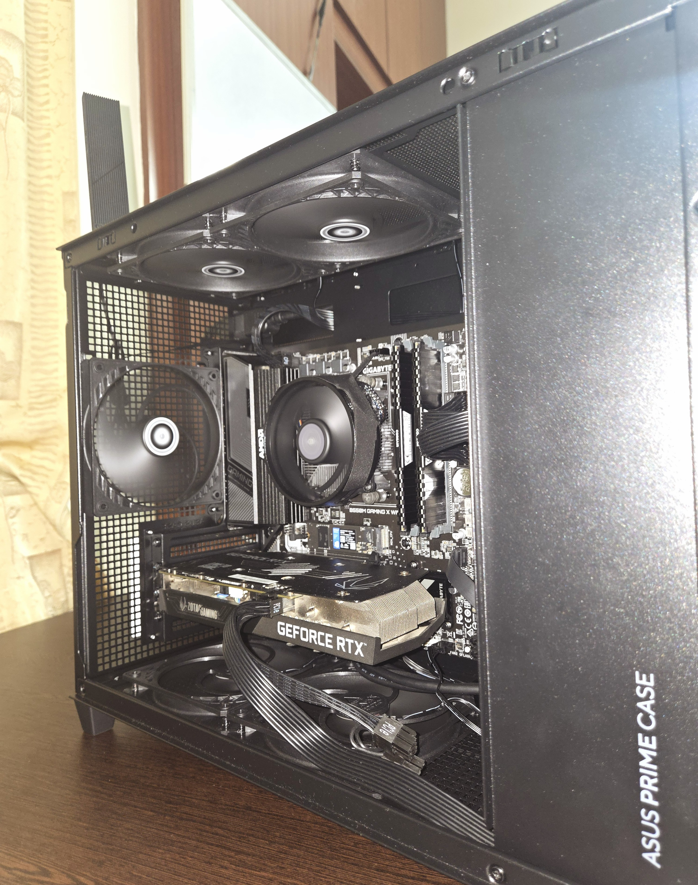
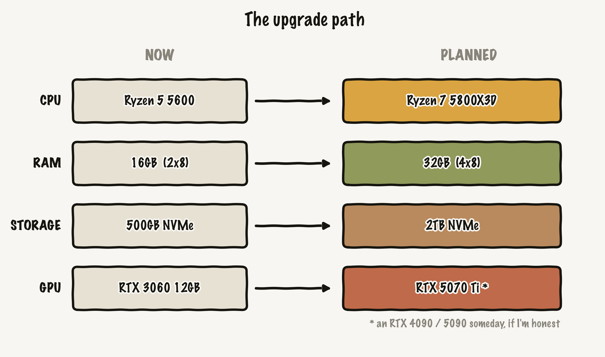

Building my own PC has been a quiet dream for years. I wanted to do it a while back and then didn't. I didn't have the headspace, and honestly I didn't even know what I was building *for*. "A good PC" isn't really a spec, so I sat on it.

Then 2026 came around, which is honestly a rough time to be buying PC parts. RAM, GPU, and SSD prices are all over the place right now, mostly thanks to how much demand AI has created. So naturally this is the year I decided to finally do it.

This post is how I built a PC in that market: how I made the decisions, the trade-offs, and what I learned on the way. If you're looking at your own first build and feeling lost in all the choices, maybe my reasoning helps.

## The spark

I was lying in bed one night scrolling YouTube when Christian Selig's [*"I made the PC I couldn't buy"*](https://www.youtube.com/watch?v=7HgAN5cEmkk) showed up in my feed.

What got me was less the build itself and more the way he thought about it.

So this build is basically a derivative of that video, big shoutout to Christian. And it turns out I ended up buying some of the same parts he did without even planning to.

## Set the expectations before the parts

Before pricing a single part, I wrote down what I actually wanted from this machine. Most first-timers skip this, and I almost did too, but it's the thing that makes every later decision easy. Here's what I wrote down:

Five constraints. Everything after this was just me trying to hit them for as little money as possible.

## Choosing the components

PC building is really personal, and there are a dozen valid answers for every slot. The trick is to let your constraints narrow things down instead of your FOMO.

### The pricing reality shaped everything

With RAM, SSD, and GPU prices all inflated, one decision got made for me: DDR5 was out. The premium just wasn't worth it for budget gaming, so I went DDR4 from the start. That one call decided the CPU and motherboard too.

### CPU + motherboard

For budget gaming, AMD was the easy value pick. I went with the **Ryzen 5 5600** on the **AM4** socket. It's a mature, cheap platform and still plenty for 1080p and 1440p gaming.

For the board, the "compact" goal pushed me to **micro-ATX**, the middle ground between a full ATX board (too big) and mini-ITX (small but pricier and fiddly). I picked the **Gigabyte B550M Gaming X** with Wi-Fi 6. It covered everything I needed: AM4 socket, four RAM slots, M.2 support, Wi-Fi and Bluetooth built in, at a fair price.

### GPU

This is where most of the budget and most of the overthinking went.

I'm on a 1080p monitor today and want some room for 2K later, so I wasn't chasing the top of the stack. I just wanted value for money. New cards were rough: the new 50-series was way over my budget, and even older 30/40-series new stock wasn't much better.

So I went secondhand. After digging through Amazon, OLX, and a bunch of listings, I got lucky and found a **Zotac RTX 3060 Twin Edge 12GB** for **₹19,500**, with 6 to 8 months of warranty left as a safety net. The 12GB of VRAM actually helps with modern games, and at that price it was the best value call in the whole build.

### Storage, RAM, PSU

- **Storage:** a **WD Blue SN5100 500GB** Gen4 NVMe M.2. Fast, and easy to add a second drive later.
- **RAM:** **16GB DDR4 3200** (2×8GB Corsair Vengeance LPX) in dual channel.
- **PSU:** an **850W** MSI MAG A850GL (Gold, fully modular). It's way more than this build needs right now (the system pulls around 300 to 400W under load), but that's on purpose. When I upgrade the GPU the headroom is already there, and a good Gold unit stays efficient even when it's barely loaded.

### The case

The **Asus Prime AP201** mini tower gave me the compact, "could sit in the living room" feel I wanted, while still fitting a micro-ATX board and a full-size GPU. I added **5× Arctic P12 Slim** fans to keep airflow decent in a small box.

## Jugaad

[*Jugaad*](https://en.wikipedia.org/wiki/Jugaad) is the Indian art of the frugal fix that just makes things work, and that's basically my whole buying strategy. If I had to boil it down to one idea: almost every PC part follows the same curve of performance against price, and it splits into three zones.

My plan was to stay in that best value zone for every part and only spend where it actually mattered.

## The parts

The full list if you want exact models: a **Ryzen 5 5600** CPU (₹11,999, new), a **Zotac RTX 3060 12GB** GPU (₹19,500, used), a **Gigabyte B550M Gaming X Wi-Fi 6** board (₹10,349), **16GB Corsair Vengeance LPX DDR4-3200** (₹11,344), a **WD Blue SN5100 500GB** NVMe (₹8,515), an **MSI MAG A850GL** 850W Gold PSU (₹8,694), an **Asus Prime AP201** case (₹5,799), and **5× Arctic P12 Slim** fans (₹4,613). ₹80,813 all in.

Plus two tools that earned their keep: a Bosch ratchet screwdriver (₹848) and a Stanley PH2 screwdriver (₹178).

The full build, part by part: [PCPartPicker list](https://pcpartpicker.com/list/RTBYNp).

## Build day

Most of the parts showed up three days before the case, which was the last to arrive, and I had zero patience to wait. So instead of sitting on them, I built a test bench: everything laid out on the box, no case, just to get the boring stuff done. I installed Windows, all the drivers, and updated the BIOS up front so that when the case came it would be plug and play.



Putting the parts together the first time felt like doing surgery. I was scared I'd break something expensive. Good thing that nervousness happened on the test bench and not inside the case.

I hit the power button for the first time and nothing happened. Dead. My heart sank and I thought I'd fried something. Turns out I just hadn't pushed the motherboard power cable in all the way. Once I seated every cable properly it booted right up. That first POST is one of the best feelings I've had in a while, a small but real "I actually did it" moment.

> **Tip:** keep the motherboard manual open the whole time. Knowing exactly where each cable and header goes saved me more than once. Half of "is it broken?" is really "is it plugged in all the way?"

When the case finally came, cable management was the hard part. Two things helped: plan where the cables go before you commit to them, and install the PSU and all the fans before the motherboard. I'd also planned the airflow ahead of time, two intakes at the bottom and exhaust at the back and top.

## Future plans

The whole reason for the constraints was a clear upgrade path, and this is where the "boring" future-proof choices pay off. The AM4 board, the oversized 850W PSU, and the roomy but compact case all carry straight over, so upgrading is just swapping the parts that actually matter instead of rebuilding.

The **Ryzen 7 5800X3D** is the dream AM4 chip to end on, a straight drop-in that's great for gaming. Then double the RAM to 32GB, jump to 2TB of storage, and when the budget (and the GPU market) allows, move to an **RTX 5070 Ti**. And yeah, maybe an RTX 4090 or 5090 someday if I'm honest with myself.

## Wrapping up

This build taught me a few things. **Patience**, mostly. And pre-**planning**: being honest about what you already have and what you actually need is most of the work. The spec sheet is the easy part. Also that it won't go smoothly, and that's fine. I made mistakes and learned from every one of them.

It's not over either. Once I upgrade the storage I want to dual-boot a Linux distro, probably CachyOS, Fedora, Bazzite, or SteamOS. That, plus a proper benchmark of the rig, might turn into future posts.

If there's one thing to take from this: a PC build is super customizable, and there's no single "correct" PC. There are just options, and the right one is whatever fits you, your budget, your purpose, your constraints. Mine was ₹80k of careful trade-offs aimed at the best value zone. Yours will look different, and that's the whole point. :)

